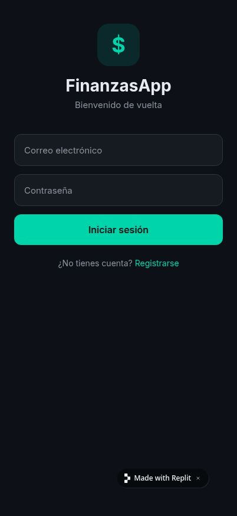

# Finx 2.0 — App de Finanzas Personales

<p align="center">
  
  
  
</p>

<p align="center">
  <strong>Controla tus finanzas personales desde tu bolsillo</strong><br/>
  App móvil construida con Expo + React Native y Supabase como backend
</p>

---

## ✨ Características

- 🔐 **Autenticación** — Registro e inicio de sesión con Supabase Auth
- 🏠 **Dashboard** — Saldo total, ingresos y gastos del mes, previsión, tendencias
- 💸 **Transacciones** — Registra gastos, ingresos, gastos en tarjeta y transferencias
- 🗓️ **Recurrentes** — Suscripciones y cuotas fijas con activación/desactivación
- ⏳ **Pendientes** — Pagos pendientes con opción de marcar como pagado
- 💳 **Tarjetas de crédito** — Límite, saldo, día de cierre y vencimiento
- 🏦 **Cuentas** — Billetera, banco y ahorros con saldo en tiempo real
- 🏷️ **Categorías** — Categorías personalizadas con icono y color para gastos e ingresos
- 📊 **Estadísticas** — Gráficos de gastos por categoría y comparativa mensual
- 💰 **Presupuestos** — Límites mensuales por categoría con barra de progreso
- ☁️ **Sincronización** — Todos los datos sincronizados en la nube con Supabase

---

## 📱 Stack Tecnológico

| Capa | Tecnología |
|------|-----------|
| Framework móvil | Expo 54 + React Native 0.81 |
| Navegación | Expo Router 6 (file-based) |
| Backend / Auth | Supabase (PostgreSQL + Auth) |
| Persistencia local | AsyncStorage |
| Fuente | Inter (Google Fonts) |
| Íconos | Expo Vector Icons (Feather + MaterialCommunityIcons) |
| Gestos | React Native Gesture Handler |
| Animaciones | React Native Reanimated |

---

## 🚀 Instalación

### Prerrequisitos

- Node.js 18+
- pnpm 9+
- Cuenta en [Supabase](https://supabase.com)
- Expo Go en tu teléfono (o Android/iOS emulador)

### 1. Clonar el repositorio

```bash
git clone https://github.com/lanuza-17/Finx2.0.git
cd Finx2.0
pnpm install
```

### 2. Configurar variables de entorno

Crea el archivo `artifacts/finance-app/.env.local`:

```env
EXPO_PUBLIC_SUPABASE_URL=https://tu-proyecto.supabase.co
EXPO_PUBLIC_SUPABASE_ANON_KEY=tu-anon-key
```

### 3. Crear las tablas en Supabase

Ve a tu proyecto en Supabase → **SQL Editor** y ejecuta el archivo:

```
artifacts/finance-app/supabase-schema.sql
```

### 4. Correr la app

```bash
pnpm --filter @workspace/finance-app run dev
```

Escanea el QR con **Expo Go** (Android) o la app **Cámara** (iOS).

---

## 📁 Estructura del proyecto

```
artifacts/finance-app/
├── app/
│   ├── (auth)/
│   │   └── login.tsx          # Pantalla de login / registro
│   ├── (tabs)/
│   │   ├── index.tsx          # Dashboard principal
│   │   ├── transactions.tsx   # Lista de transacciones
│   │   ├── stats.tsx          # Estadísticas
│   │   └── more.tsx           # Más opciones
│   ├── add-transaction.tsx    # Agregar transacción
│   ├── add-recurrence.tsx     # Agregar recurrencia
│   ├── accounts.tsx           # Gestión de cuentas
│   ├── cards.tsx              # Gestión de tarjetas
│   ├── categories.tsx         # Gestión de categorías
│   ├── recurrences.tsx        # Pagos recurrentes
│   ├── pending.tsx            # Pagos pendientes
│   ├── budgets.tsx            # Presupuestos
│   └── transaction-detail.tsx # Detalle de transacción
├── context/
│   ├── AuthContext.tsx        # Autenticación global
│   └── FinanceContext.tsx     # Estado financiero global
├── components/
│   ├── MonthSelector.tsx      # Selector de mes
│   ├── TransactionItem.tsx    # Item de transacción
│   └── SummaryCard.tsx        # Tarjeta de resumen
├── constants/colors.ts        # Tema oscuro (#0d1117)
├── utils/format.ts            # Formateo de moneda y fechas
└── supabase-schema.sql        # Schema de base de datos
```

---

## 🎨 Tema

La app usa un tema oscuro personalizado:

| Token | Color | Uso |
|-------|-------|-----|
| Background | `#0d1117` | Fondo principal |
| Card | `#161b22` | Tarjetas y contenedores |
| Primary | `#00d4aa` | Acento principal / teal |
| Income | `#3fb950` | Ingresos (verde) |
| Expense | `#f85149` | Gastos (rojo) |
| Border | `#30363d` | Separadores |

---

## 🗄️ Esquema de Base de Datos

```
accounts        — Cuentas del usuario (billetera, banco, ahorros)
credit_cards    — Tarjetas de crédito con límite y saldo
categories      — Categorías personalizadas de gasto/ingreso
transactions    — Todas las transacciones con tipo y estado
recurrences     — Pagos recurrentes mensuales
budgets         — Presupuestos mensuales por categoría
```

Todas las tablas tienen **Row Level Security (RLS)** activado.

---

## 📦 Publicar en Play Store / App Store

```bash
# Instalar EAS CLI
npm install -g eas-cli

# Configurar EAS
eas build:configure

# Build para Android
eas build --platform android

# Build para iOS
eas build --platform ios
```

---

## 📄 Licencia

MIT — libre para uso personal y comercial.

---

<p align="center">Hecho con ❤️ usando Expo + Supabase</p>
